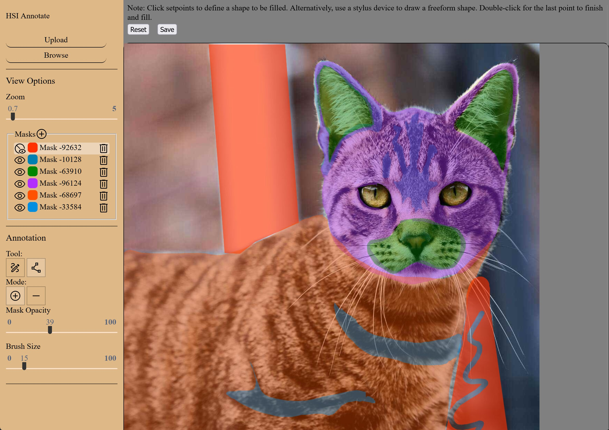
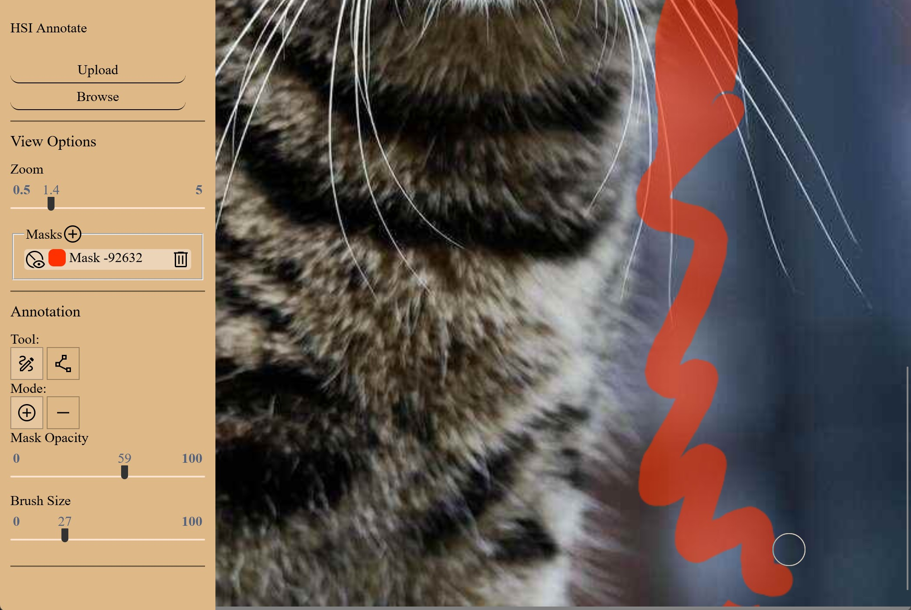
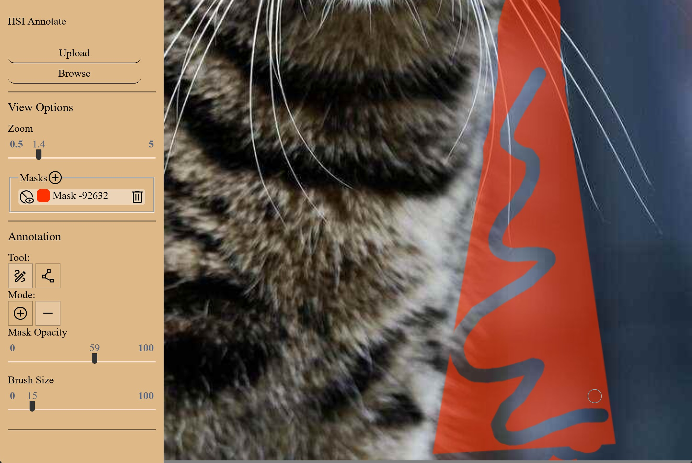
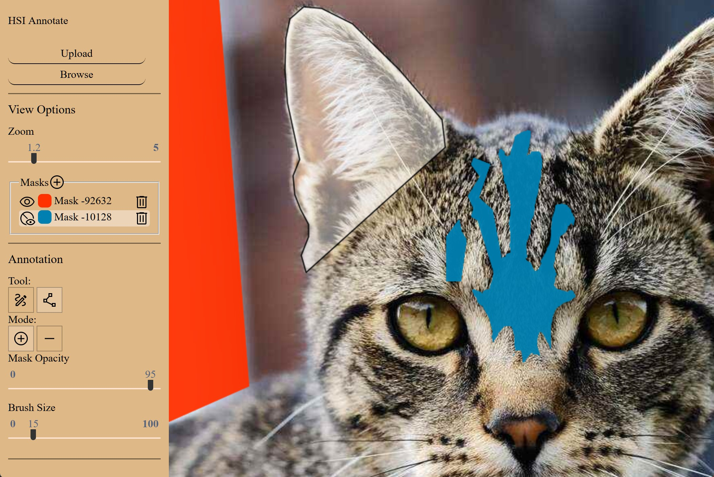

# HsiAnnotate
This is the hyperspectral image annotation interface developed for the Fall 2022 UEF Industrial Project course.  The application is built in Angular and uses the HTML Canvas API to provide annotation tools for adding and modifying autogenerated segmentation masks.  Examples of annotation tool usage are shown below.

## Application view
A hyperspectral image is shown with its individual masks rendered in varying colors.

## Brush tool (add mode)
A brush tool can be used to add to the masks or create new mask layers with.

## Brush tool (subtract mode)
In subtract mode, the brush tool can be used to effectively erase mask areas.

## Fill tool (add mode)
A polygonal fill tool can be used in add mode to draw out precise shapes and fill them in for a mask.

## Fill tool (subtract mode)
In subtract mode, the same fill tool can be used for precision removal of mask areas.

## Contributing
This project was generated with [Angular CLI](https://github.com/angular/angular-cli) version 13.3.9.

### Development server

Run `ng serve` for a dev server. Navigate to `http://localhost:4200/`. The application will automatically reload if you change any of the source files.

### Code scaffolding

Run `ng generate component component-name` to generate a new component. You can also use `ng generate directive|pipe|service|class|guard|interface|enum|module`.

### Build

Run `ng build` to build the project. The build artifacts will be stored in the `dist/` directory.

### Running unit tests

Run `ng test` to execute the unit tests via [Karma](https://karma-runner.github.io).

### Running end-to-end tests

Run `ng e2e` to execute the end-to-end tests via a platform of your choice. To use this command, you need to first add a package that implements end-to-end testing capabilities.

### Further help

To get more help on the Angular CLI use `ng help` or go check out the [Angular CLI Overview and Command Reference](https://angular.io/cli) page.
